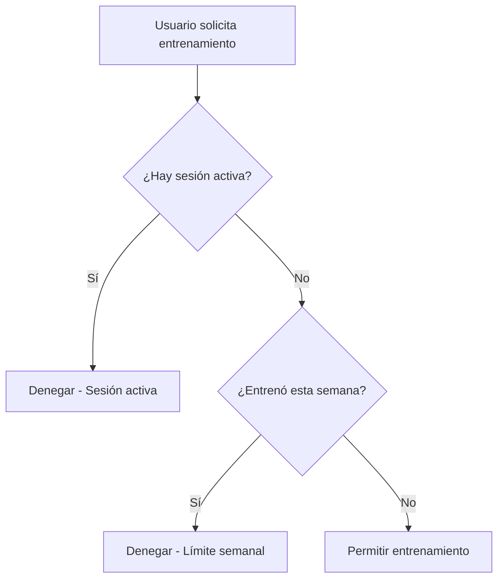
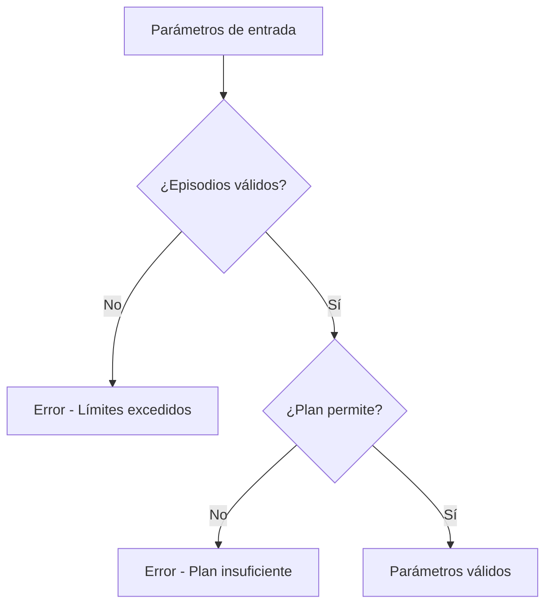
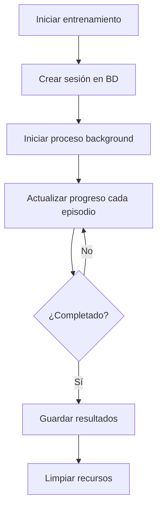

# Sistema RL Director - Implementación para Producción

## Resumen Ejecutivo

El **Sistema RL Director** es una implementación completa de Reinforcement Learning que actúa como coordinador inteligente de los modelos IA existentes (Brain Max, Brain Ultra, Brain Predictor y MegaMind). Este sistema proporciona optimización dinámica de estrategias de trading con límites de producción y gestión de recursos.

## Características Principales

### 🎯 **Coordinación Inteligente de Modelos**
- **Ponderación Dinámica**: Ajusta automáticamente la influencia de cada modelo según las condiciones del mercado
- **Consenso de Señales**: Genera señales de trading basadas en el acuerdo de múltiples modelos
- **Optimización Continua**: Mejora constantemente la estrategia basándose en el rendimiento

### 🔒 **Sistema de Límites y Permisos**
- **Límite Semanal**: Un entrenamiento por usuario por semana
- **Límites por Plan**: Diferentes límites de episodios según el plan de suscripción
- **Validación de Parámetros**: Verificación automática de parámetros de entrenamiento
- **Control de Sesiones**: Prevención de múltiples entrenamientos simultáneos

### 📊 **Monitoreo en Tiempo Real**
- **Barra de Progreso**: Seguimiento visual del entrenamiento
- **Estimación de Tiempo**: Cálculo dinámico del tiempo restante
- **Estado de Sesiones**: Monitoreo de sesiones activas y completadas
- **Historial de Entrenamientos**: Registro completo de todas las sesiones

## Arquitectura del Sistema

### Backend (FastAPI + Python)

#### 1. **Modelo de Base de Datos**
```python
class RLTrainingSession(Base):
    session_id: str          # ID único de la sesión
    user_id: str            # ID del usuario
    episodes: int           # Número de episodios
    algorithm: str          # Algoritmo usado (DQN, PPO, etc.)
    status: str             # Estado (running, completed, failed, cancelled)
    progress: float         # Progreso (0.0 a 1.0)
    current_episode: int    # Episodio actual
    total_episodes: int     # Total de episodios
    # ... más campos
```

#### 2. **Servicio de Entrenamiento**
```python
class RLTrainingService:
    def can_user_train(user_id)           # Verifica permisos
    def validate_training_params()        # Valida parámetros
    def start_training()                  # Inicia entrenamiento
    def get_training_progress()           # Obtiene progreso
    def cancel_training()                 # Cancela entrenamiento
    def get_user_training_history()       # Obtiene historial
```

#### 3. **Endpoints API**
- `GET /api/rl/status` - Estado del RL Director
- `GET /api/rl/performance` - Rendimiento del sistema
- `GET /api/rl/active-signals` - Señales activas
- `GET /api/rl/can-train/{user_id}` - Verifica permisos
- `POST /api/rl/validate-params` - Valida parámetros
- `POST /api/rl/start-training` - Inicia entrenamiento
- `GET /api/rl/training-progress/{session_id}` - Progreso
- `POST /api/rl/cancel-training/{session_id}` - Cancela
- `GET /api/rl/training-history/{user_id}` - Historial

### Frontend (React + TypeScript)

#### 1. **Componentes Principales**
- `RLDashboard` - Panel principal
- `RLStatusPanel` - Estado y controles de entrenamiento
- `ModelCoordinationPanel` - Coordinación de modelos
- `ActiveSignalsPanel` - Señales activas
- `RLPerformancePanel` - Rendimiento
- `AdvancedConfigurationPanel` - Configuración avanzada

#### 2. **Funcionalidades de UI**
- **Controles de Entrenamiento**: Inputs con límites y validación
- **Barra de Progreso**: Visualización en tiempo real
- **Información de Permisos**: Estado de capacidad de entrenamiento
- **Configuración por Plan**: Límites según suscripción

## Límites y Configuración por Plan

### 📋 **Límites de Episodios**
| Plan | Mínimo | Máximo | Recomendado | Tiempo Estimado |
|------|--------|--------|-------------|-----------------|
| Starter | 100 | 1,000 | 500 | 5-10 min |
| Basic | 100 | 2,000 | 1,000 | 10-20 min |
| Pro | 100 | 5,000 | 2,000 | 20-40 min |
| Elite | 100 | 10,000 | 5,000 | 40-80 min |

### ⏰ **Límites de Frecuencia**
- **Máximo**: 1 entrenamiento por semana por usuario
- **Duración Máxima**: 30 minutos por sesión
- **Sesiones Simultáneas**: 1 por usuario

## Flujo de Trabajo del Sistema

### 1. **Verificación de Permisos**


### 2. **Validación de Parámetros**


### 3. **Proceso de Entrenamiento**


## Gestión de Recursos

### 💾 **Almacenamiento**
- **Modelos Entrenados**: `models/rl_trained/{session_id}/`
- **Logs de Entrenamiento**: `logs/rl_training/{session_id}/`
- **Base de Datos**: Tabla `rl_training_sessions`

### 🔄 **Procesamiento**
- **Entrenamiento Asíncrono**: Procesos en background
- **Polling de Progreso**: Actualización cada 2 segundos
- **Limpieza Automática**: Recursos liberados al completar

### 📈 **Monitoreo**
- **Sesiones Activas**: Control en memoria
- **Progreso en Tiempo Real**: Actualización continua
- **Métricas de Rendimiento**: Seguimiento de resultados

## Seguridad y Validación

### 🔐 **Validaciones de Seguridad**
- **Verificación de Usuario**: Solo propietario puede cancelar
- **Límites de Recursos**: Prevención de abuso
- **Validación de Parámetros**: Verificación de rangos
- **Control de Concurrencia**: Una sesión por usuario

### ⚠️ **Manejo de Errores**
- **Errores de Entrenamiento**: Captura y registro
- **Timeouts**: Límites de tiempo automáticos
- **Recuperación**: Limpieza de recursos fallidos
- **Logging**: Registro detallado de errores

## Instalación y Configuración

### 1. **Migración de Base de Datos**
```bash
# Ejecutar migración para crear tabla RL
alembic upgrade head
```

### 2. **Configuración del Backend**
```bash
# Instalar dependencias
pip install -r requirements.txt

# Iniciar servidor
uvicorn src.main:app --reload --host 0.0.0.0 --port 8000
```

### 3. **Configuración del Frontend**
```bash
# Instalar dependencias
npm install

# Iniciar aplicación
npm start
```

## Pruebas del Sistema

### 🧪 **Script de Pruebas**
```bash
# Ejecutar pruebas completas
python test_rl_training_system.py
```

### 📋 **Pruebas Incluidas**
- Estado del RL Director
- Rendimiento del sistema
- Señales activas
- Permisos de entrenamiento
- Validación de parámetros
- Inicio y progreso de entrenamiento
- Historial de entrenamientos
- Ejecución de señales

## Monitoreo y Mantenimiento

### 📊 **Métricas Clave**
- **Sesiones Activas**: Número de entrenamientos en curso
- **Tasa de Éxito**: Porcentaje de entrenamientos completados
- **Tiempo Promedio**: Duración típica de entrenamientos
- **Uso de Recursos**: CPU y memoria por sesión

### 🔧 **Mantenimiento**
- **Limpieza de Logs**: Eliminación de logs antiguos
- **Optimización de BD**: Índices y consultas
- **Actualización de Modelos**: Mejoras en algoritmos
- **Backup de Datos**: Respaldo de sesiones importantes

## Consideraciones de Producción

### 🚀 **Escalabilidad**
- **Procesos Distribuidos**: Entrenamientos en workers separados
- **Cola de Trabajos**: Sistema de colas para entrenamientos
- **Balanceo de Carga**: Distribución de recursos
- **Caché**: Optimización de consultas frecuentes

### 🔒 **Seguridad**
- **Autenticación**: Verificación de usuarios
- **Autorización**: Control de acceso por plan
- **Auditoría**: Registro de todas las acciones
- **Encriptación**: Protección de datos sensibles

### 📈 **Performance**
- **Optimización de Consultas**: Índices en BD
- **Caché de Resultados**: Almacenamiento temporal
- **Compresión de Datos**: Reducción de almacenamiento
- **Monitoreo Continuo**: Alertas de rendimiento

## Conclusión

El **Sistema RL Director** proporciona una solución completa y robusta para la coordinación inteligente de modelos IA en un entorno de producción. Con límites claros, monitoreo en tiempo real y gestión eficiente de recursos, el sistema está diseñado para escalar y mantener la estabilidad en entornos de alta demanda.

### 🎯 **Beneficios Clave**
- **Optimización Automática**: Mejora continua de estrategias
- **Control de Recursos**: Prevención de abuso y sobrecarga
- **Experiencia de Usuario**: Interfaz intuitiva y responsiva
- **Escalabilidad**: Preparado para crecimiento futuro
- **Seguridad**: Protección completa de datos y recursos

---

**Versión**: 1.0.0  
**Fecha**: Enero 2025  
**Estado**: Producción Ready 